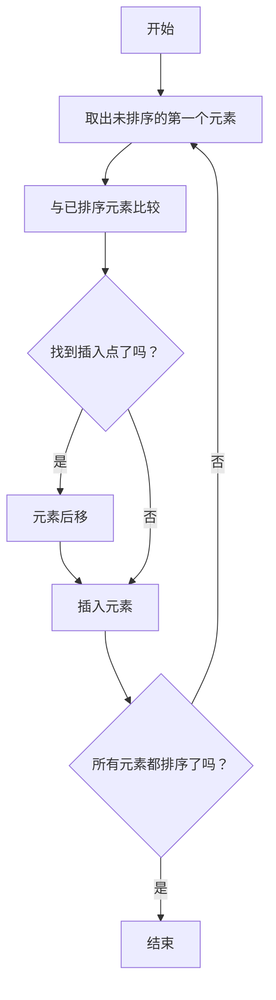

```mermaid
graph TD
    A[开始] --> B[取出未排序的第一个元素]
    B --> C[与已排序元素比较]
    C --> D{找到插入点了吗？}
    D -- 是 --> E[元素后移]
    E --> F[插入元素]
    F --> G{所有元素都排序了吗？}
    D -- 否 --> F
    G -- 是 --> H[结束]
    G -- 否 --> B

```